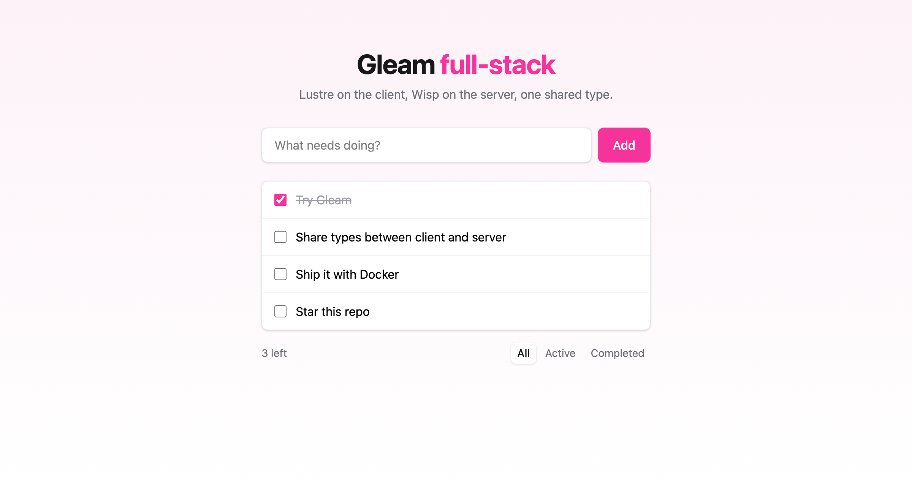

<div align="center">
  <h1>✨ Gleam full-stack starter</h1>
  <p><strong>One language, one type, both sides of the wire.</strong><br/>
  A ready-to-go Gleam app with a <a href="https://github.com/lustre-labs/lustre">Lustre</a> frontend, a <a href="https://github.com/gleam-wisp/wisp">Wisp</a> backend and a shared package the compiler checks against both.</p>

  <p>
    <a href="https://github.com/stijnwtf/gleam-fullstack/actions/workflows/ci.yml"></a>
    <a href="https://gleam.run"></a>
    <a href="LICENSE"></a>
    <a href="https://github.com/stijnwtf/gleam-fullstack/stargazers"></a>
  </p>

  
</div>

## Why

Gleam compiles to **Erlang** and **JavaScript**, which means your frontend and backend can share the exact same types, JSON codecs and validation. Change a field on the server and the client stops compiling until you fix it. No OpenAPI generators, no drifting DTOs.

Getting there still takes a lot of glue though: three projects, path dependencies, a dev proxy, static file serving, Docker. This repo is that glue, done once, with a small working example on top.

## What's inside

| | |
| --- | --- |
| 🧩 **`shared/`** | Types, JSON encoders/decoders and validation. Compiles to both targets. |
| 🌐 **`client/`** | [Lustre](https://hexdocs.pm/lustre) SPA (The Elm Architecture), typed HTTP via [rsvp](https://hexdocs.pm/rsvp), Tailwind CSS v4, live reload |
| ⚙️ **`server/`** | [Wisp](https://hexdocs.pm/wisp) + [Mist](https://hexdocs.pm/mist) JSON API, OTP actor store, static file serving with SPA fallback |
| 🧪 **Tests** | gleeunit on every package: shared codecs on both targets, server routes via `wisp/simulate`, client `update` as pure functions |
| 🐳 **Docker** | Multi-stage build into a ~150 MB Alpine image, no Gleam toolchain at runtime |
| 🤖 **CI** | GitHub Actions: format check, all tests, client build, Docker build |

## Quick start

You need [Gleam](https://gleam.run/getting-started/installing/) 1.19+, Erlang/OTP 28+ and rebar3 (versions are pinned in `.tool-versions` for asdf/mise; on macOS: `brew install gleam erlang rebar3`).

```bash
git clone https://github.com/stijnwtf/gleam-fullstack my-app
cd my-app
make dev
```

- Client with live reload: http://localhost:1234 (proxies `/api` to the server)
- API server: http://localhost:8000

Or build the client and serve everything from the Gleam server:

```bash
make run   # http://localhost:8000
```

## Commands

| Command | Does |
| --- | --- |
| `make dev` | Run server and client dev server side by side |
| `make run` | Build the client into `server/priv/static` and start the server |
| `make test` | Run all test suites (shared on Erlang and JavaScript) |
| `make check` | Format check + tests, same as CI |
| `make format` | Format all Gleam code |
| `make docker` | Build the production image |

## How it fits together

```
shared/  ──────────────┐  (path dependency)
  src/shared/task.gleam│  Task type, to_json, decoder, validate_title
                       ▼
client/ (JavaScript)   server/ (Erlang)
  client.gleam  main     server.gleam         main: config, store, Mist
  client/api    HTTP     server/router        /api/tasks routes + static files
  client/model  update   server/store         OTP actor holding state
  client/view   HTML     server/web           middleware
       │                        ▲
       └── lustre/dev build ────┘  writes JS, CSS and index.html to server/priv/static
```

The same `task.decoder()` parses the server's response in the browser and the same `task.validate_title` runs on both sides: instant feedback on the client, the real check on the server.

## API

| Method | Path | Body | Response |
| --- | --- | --- | --- |
| `GET` | `/api/health` | | `ok` |
| `GET` | `/api/tasks` | | `Task[]` |
| `POST` | `/api/tasks` | `{"title": string}` | `201 Task` or `422 {"error"}` |
| `PATCH` | `/api/tasks/:id` | `{"completed": bool}` | `Task` or `404` |
| `DELETE` | `/api/tasks/:id` | | `204` or `404` |

## Making it yours

- **Add a field.** Add it to `Task` in `shared/src/shared/task.gleam`, update `to_json` and `decoder`, then follow the compiler errors through server and client.
- **Add a database.** `server/src/server/store.gleam` is an in-memory actor with a tiny API (`all`, `create`, `set_completed`, `delete`). Replace it with [pog](https://hexdocs.pm/pog) (Postgres) or [sqlight](https://hexdocs.pm/sqlight) (SQLite) and keep the same functions.
- **Add a page.** Lustre apps are `init`, `update` and `view`. For multiple pages, add [modem](https://hexdocs.pm/modem) for client-side routing; the server already falls back to `index.html` for unknown paths.
- **Configuration.** The server reads `PORT` (default `8000`) and `SECRET_KEY_BASE` (random if unset, set it in production).

## Deploy

```bash
docker build -t my-app .
docker run -p 8000:8000 -e SECRET_KEY_BASE=$(openssl rand -hex 32) my-app
```

The image runs anywhere containers do: Fly.io, Railway, Render, Cloud Run or your own VPS.

## Contributing

Issues and PRs welcome. Run `make check` before opening one.

If this saved you an afternoon of setup, a ⭐️ helps other Gleam folks find it.

## License

[MIT](LICENSE)
